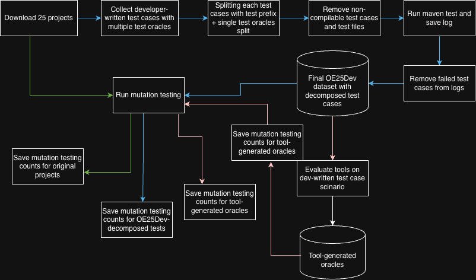

# OE25Dev Framework

A comprehensive dataset and framework for evaluating test oracle generation techniques on developer-written Java unit tests.

## Overview

OE25Dev is a dataset of developer-written Java unit tests designed to support research on test oracle generation and evaluation. Unlike prior benchmarks that rely mainly on automatically generated tests, OE25Dev focuses on realistic test suites written and maintained by developers in real-world open-source projects.

The dataset enables reproducible evaluation of oracle generation techniques, including large language model (LLM)-based approaches, under practical testing conditions.

## Key Features

- **Developer-Written Test Suites**: Real-world test cases from open-source projects
- **Single-Oracle Decomposition**: Multi-oracle tests split into single-oracle instances
- **Mutation-Based Evaluation**: Systematic comparison of oracle effectiveness
- **End-to-End Pipeline**: Complete framework from dataset construction to evaluation
- **Extensible Benchmark**: Support for evaluating various oracle generation tools

## Pipeline Overview



The OE25Dev pipeline consists of the following stages:

1. **Project Preparation**: Download and collect developer-written test cases
2. **Test Decomposition**: Split multi-oracle tests into single-oracle instances
3. **Test Execution**: Run and validate decomposed test cases
4. **Mutation Testing**: Apply mutations to evaluate oracle effectiveness
5. **Oracle Generation**: Generate oracles using target tools
6. **Evaluation**: Compare original, decomposed, and tool-generated oracles

## Repository Structure

```
.
├── projects_original/      # Original unmodified open-source projects
├── projects_decompose/     # Projects with decomposed single-oracle tests
├── scripts/                # All framework scripts and tools
│   ├── download_projects.sh
│   ├── Final_mvn_run_original.sh
│   ├── main.sh
│   ├── final_mvn_run_decomposed.sh
│   ├── run_pitest.sh
│   ├── remove_assertion.py
│   ├── inject_generated_assertions.py
│   └── evaluate_tool.sh
├── inputs.csv              # Project input configuration
└── meta.csv                # Project metadata
```

Generated test files use the suffix `OE25Dev.java`.

## Usage

### Prerequisites

- Java Development Kit (JDK)
- Maven
- Python 3.x
- PIT (for mutation testing)

### Step 1: Download Projects

If the projects are not already available, download them using:

```bash
scripts/download_projects.sh
```

The downloaded projects are stored in `projects_original/`.

### Step 2: Run Original Test Suites

Execute the original test suites and collect baseline statistics:

```bash
scripts/Final_mvn_run_original.sh
```

This step builds each project and records the number of executed tests.

### Step 3: Build OE25Dev Decomposed Tests

Construct the OE25Dev dataset:

```bash
scripts/main.sh
```

This script reads `inputs.csv` and `meta.csv`, decomposes multi-oracle test methods into single-oracle test cases, and generates new test files with the suffix `OE25Dev.java`.

### Step 4: Run Decomposed Test Suites

Execute the decomposed test suites:

```bash
scripts/final_mvn_run_decomposed.sh
```

This step records test execution statistics for the OE25Dev test cases.

### Step 5: Mutation Testing

Run mutation testing using PIT:

```bash
scripts/run_pitest.sh
```

Mutation testing logs are saved, and final mutation statistics are recorded in `mutation_count.csv`.

### Step 6: Oracle Removal

Prepare oracle-free test cases:

```bash
scripts/remove_assertion.py
```

All assertion-based and exception-based oracles are removed and replaced with a placeholder token.

### Step 7: Oracle Injection

After generating oracles, inject them into the test cases:

```bash
scripts/inject_generated_assertions.py
```

### Step 8: Tool Evaluation

Evaluate generated oracles:

```bash
scripts/evaluate_tool.sh
```

This step:
- Compiles and executes the modified test suites
- Comments out tests with compilation errors
- Records test execution results, false positives, mutation kills, and unique bug identification statistics

## Evaluation Metrics

OE25Dev supports analysis of:

- **Mutation Kill Rates**: Effectiveness of oracles in detecting injected faults
- **False Positives**: Tests that fail incorrectly
- **Unique Bug Identification**: Novel bugs detected by generated oracles
- **Compilation Success**: Syntactic correctness of generated oracles

## Use Cases

OE25Dev enables:

- Benchmarking oracle generation tools and LLMs
- Comparing different oracle generation approaches
- Analyzing oracle quality in real-world contexts
- Studying the impact of test decomposition on oracle effectiveness

## Citation

If you use OE25Dev in your research, please cite our paper:

```bibtex
@article{oe25dev,
  title={OE25Dev: A Benchmark for Evaluating Test Oracle Generation on Developer-Written Test Suites},
  author={[Authors]},
  journal={[Journal/Conference]},
  year={2025}
}
```

## License

[License information to be added]

---

OE25Dev provides a realistic and extensible benchmark for evaluating test oracle generation techniques on developer-written test suites. By decomposing tests at the oracle level and supporting a complete evaluation pipeline, OE25Dev enables systematic and fine-grained analysis of oracle quality in real-world software projects.
